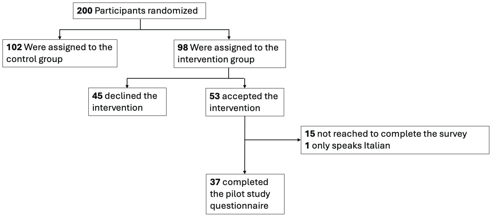

 

 

## "Acceptance and preferences for different nicotine substitute products to reduce tobacco smoking in people living with HIV: Results from an internal pilot study of a randomized trial"

The results of this internal pilot support the feasibility of the RETUNE trial. The observed acceptance rate was similar to our estimate. E-cigarettes were the preferred product. We are continuing recruitment for the RETUNE trial.

 

[{fig-align="center" width="700"}](https://www.tobaccoinduceddiseases.org/Acceptance-and-preferences-for-different-nicotine-substitute-products-to-reduce-tobacco,218987,0,2.html)

 

 

## "Offer of a menu of different nicotine substitute products to REduce Tobacco Use iN pEople living with HIV (RETUNE): a protocol for a pragmatic randomized trial within the Swiss HIV Cohort Study"

The peer-reviewed publication of the RETUNE trial protocol provides a concise overview of the study design.

 

[{fig-align="center" width="700"}](https://link.springer.com/article/10.1186/s13063-026-09622-6)

 

 

## "Implementing a randomization consent to enable Trials within Cohorts in the Swiss HIV Cohort Study – A mixed-methods study"

The implementation of the TwiCs design, including the roll-out of a randomization consent in an existing, large-scale cohort, is feasible. The acceptance rate among participants was high.

 

[{fig-align="center" width="700"}](https://doi.org/10.1016/j.jclinepi.2025.111973)