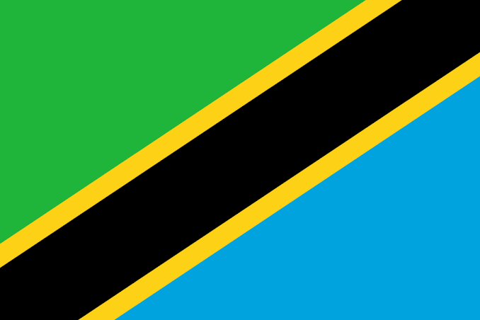

# Udhibiti wa Dijitali wa Viuavijasumu na Mafunzo kwa Wahudumu wa Afya

**DAWA ni jaribio la kimkakati linalopanga nasibu katika vikundi,
linalotathmini ufanisi wa mfumo wa dijitali wa msaada wa maamuzi ya
kliniki, mafunzo na ufuatiliaji katika kupunguza uandishi wa viuavijasumu
katika vituo vya huduma ya msingi kwenye visiwa vya Unguja na Pemba, Zanzibar, Tanzania.**

## Usuli

Uandishi wa viuavijasumu usio sahihi umeenea sana katika mazingira ya
huduma ya msingi katika nchi zenye kipato cha chini na cha kati,
ukichangia upinzani wa bakteria dhidi ya viuavijasumu (AMR), na
magonjwa na vifo vingi visivyo vya lazima. Inakadiriwa kwamba uandishi
wa viuavijasumu hutokea katika zaidi ya nusu ya mashauriano ya huduma ya
msingi katika nchi zenye kipato cha chini na cha kati.

Mifumo ya dijitali ya msaada wa maamuzi ya kliniki (CDSS) iliyounganishwa
ndani ya mifumo ya rekodi za matibabu za kielektroniki (EMR) imeonyesha
uwezo wa kuboresha udhibiti wa viuavijasumu, lakini zana zilizopo zina
mipaka muhimu: nyingi zinalenga watoto wenye umri chini ya miaka mitano
tu, na nyingi hazijaunganishwa katika miundombinu ya dijitali ya vituo
vya afya.

Mradi wa DAWA unajaribu uingiliaji kati wa kina wa udhibiti wa
viuavijasumu — ukichanganya msaada wa dijitali wa maamuzi ya kliniki
uliounganishwa ndani ya mfumo wa Rekodi ya Matibabu ya Kielektroniki ya
Zanzibar (ZanEMR) na mafunzo maalum na mikutano ya kila mwezi ya elimu
ya rika — katika madispensari ya umma kwenye visiwa vya Unguja na Pemba, Zanzibar.

## Muhtasari wa Utafiti

| | |
|---|---|
| **Jina kamili** | Jaribio la kimkakati linalopanga nasibu katika vikundi kutathmini ufanisi wa mfumo wa dijitali wa msaada wa maamuzi ya kliniki, mafunzo na ufuatiliaji kupunguza uandishi wa viuavijasumu katika vituo vya huduma ya msingi Tanzania |
| **Jina fupi** | Udhibiti wa Dijitali wa Viuavijasumu na Mafunzo kwa Wahudumu wa Afya (DAWA) |
| **Eneo la Utafiti** | Madispensari ya umma, visiwa vya Unguja na Pemba, Zanzibar, Tanzania |
| **Muundo** | Jaribio linalopanga nasibu katika vikundi lenye mikono mitatu sambamba |
| **Ukubwa wa sampuli** | Wagonjwa 5,850 (1,950 kwa kila mkono) |
| **Tarehe ya kwanza ya uandikishaji (inayokadiriwa)** | 1 Novemba 2026 |
| **Usajili** | Utasajiliwa kwenye ClinicalTrials.gov |
| **Mdhamini** | Kituo cha Afya ya Msingi na Afya ya Umma (Unisanté), Chuo Kikuu cha Lausanne, Uswisi |

## Lengo Kuu

Kutathmini ufanisi wa uingiliaji kati mbili wa udhibiti wa viuavijasumu
— zote zikiwa na msaada wa maamuzi ya kliniki uliounganishwa ndani ya
mfumo wa rekodi za matibabu za kielektroniki, na moja ikiwa na
kipengele cha ziada cha mikutano ya kila mwezi ya elimu ya rika — katika
kupunguza uandishi wa viuavijasumu kwa magonjwa ya kuambukiza katika
vituo vya huduma ya msingi kwenye visiwa vya Unguja na Pemba, Zanzibar, Tanzania.

## Mikono ya Utafiti

- **Mkono wa 1 (Uingiliaji wa Njia Nyingi):** ZanEMR-AS (msaada wa
  dijitali wa maamuzi ya kliniki ndani ya ZanEMR) na mafunzo ya awali ya
  kikundi, ziara za ufuatiliaji zinazosaidiwa, na mikutano ya kila mwezi
  ya Klamu ya Udhibiti wa Viuavijasumu.

- **Mkono wa 2 (Msaada wa Dijitali Peke Yake):** ZanEMR-AS na mafunzo
  ya awali ya kikundi na ziara za ufuatiliaji zinazosaidiwa.

- **Mkono wa 3 (Huduma ya Kawaida):** ZanEMR ya kawaida (bila vipengele
  vya udhibiti wa viuavijasumu).

::: {style="background-color: #e8f5e9; padding: 1rem; border-radius: 8px; margin-top: 2rem;"}
*Mradi wa DAWA ni ushirikiano kati ya Kituo cha Afya ya Msingi na Afya
ya Umma (Unisanté), Chuo Kikuu cha Lausanne; Taasisi ya Afya ya Ifakara
(IHI), Tanzania; na Wizara ya Afya ya Zanzibar. Unafadhiliwa na Mfuko
wa Kitaifa wa Kisayansi wa Uswisi (SNSF).*
:::

---

## Eneo la Utafiti

Jaribio la DAWA linafanyika katika madispensari ya umma kwenye **visiwa vya Unguja na Pemba, Zanzibar**, visiwa vidogo pwani ya mashariki ya Tanzania.

Zanzibar

Tanzania

<iframe src="https://www.openstreetmap.org/export/embed.html?bbox=39.00%2C-6.60%2C40.10%2C-4.70&amp;layer=mapnik" style="width:100%;height:300px;border:1px solid #ccc;border-radius:8px;" loading="lazy"></iframe>

<small style="color:#888;">Ramani © <a href="https://www.openstreetmap.org/copyright" target="_blank">OpenStreetMap</a> wachangiaji</small>

